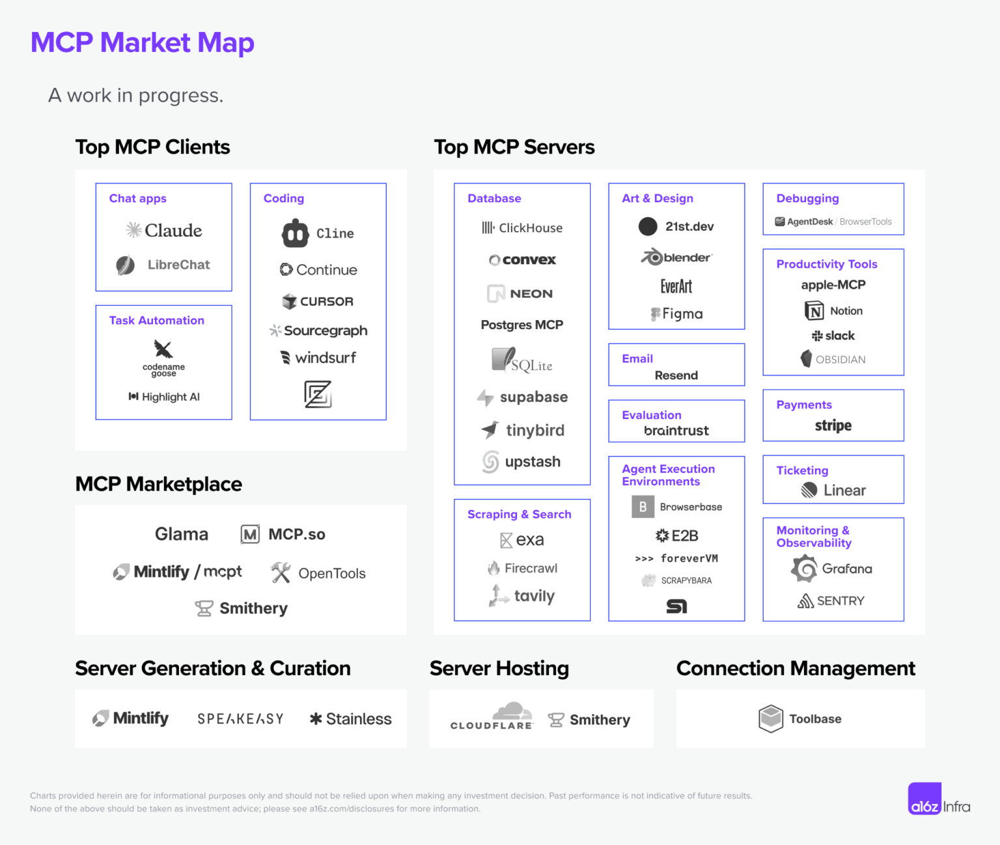

tags:: 2025, 2025/03, Sunday

- #AI again
	- **00:09** [[quick capture]]:  https://www.trae.ai/
		- CANCELLED Try it and compare with VS code; support OpenRouter
			- [[2025/04/04 Friday]] Too many options... stick with current options
	- LATER Also compare Cline with Roo Code
		- **18:55** [[quick capture]]:  https://www.reddit.com/r/ChatGPTCoding/comments/1jn36e1/roocode_vs_cline_updated_march_29/?rdt=38462 #Reddit
	- LATER Try out [[MCP]] servers
		- **00:41** [[quick capture]]:  
		- #x 
		  collapsed:: true
		  {{tweet https://x.com/liuvaayne/status/1896044429338951826?s=46}}
		- https://glama.ai/mcp/servers
		- **23:48** [[quick capture]]: Extending AI chat with Model Context Protocol (and why it matters) (Interconnected) https://interconnected.org/home/2025/02/11/mcp
		- [[2025/04/04 Friday]] Got many issues just trying to get the tech ready for MCP
	- DONE Check out Cherry Studio
		- [[Logseq]] as [[MCP]] server to AI apps
			- https://x.com/bsunter/status/1900367037438054641?s=46 #x
			  collapsed:: true
			  {{tweet https://x.com/bsunter/status/1900367037438054641?s=46}}
			- https://github.com/eefahd/logseq-integrate-any-api
			- https://plugins-doc.logseq.com/
			- **00:01** [[quick capture]]:  https://docs.logseq.com/#/page/local%20http%20server
			- [[2025/04/12 Saturday]] [[Logseq API Integration with LLM]]
				- **11:03** [[quick capture]]: MCP Servers https://mcp.so/?q=Logseq
		- **00:47** [[quick capture]]:  https://docs.cherry-ai.com/
		- Can use OpenRouter 👍🏻 and MCP
		- Supports image generation
		- https://x.com/yinsenhe/status/1903794487085965528?s=46 #x
		  collapsed:: true
		  {{tweet https://x.com/yinsenhe/status/1903794487085965528?s=46}}
		- https://x.com/LiuVaayne/status/1903069217630671125 #x
		  collapsed:: true
		  {{tweet https://x.com/liuvaayne/status/1903069217630671125?s=46}}
	- CANCELLED Check out Cursor AI
		- **01:45** [[quick capture]]:  https://www.cursor.com/cn
		- Have free plan; cannot use API; can use MCP
	- LATER **03:04** [[quick capture]]:  https://recally.io/
	- Save costs on Roo Code
		- Roo Code used up 5 USD at work just for large SQL files
		- https://www.youtube.com/watch?v=mwJx5QI2c0o
		  collapsed:: true
		  {{video https://www.youtube.com/watch?v=mwJx5QI2c0o}}
		- LATER Test his prompt
	- 05:00 AI is a deep deep abyss and there’s no way to get out of it. Just learn the basics first as #claudeprompt says
	- **05:43** [[quick capture]]: Manus vs Flowith - AI agents
		- **05:50** [[quick capture]]:  https://try.flowith.io/
		- LATER Compare them
	- Comparing [[AI development platforms]] with #apolloapp
	- 23:51 Interesting https://www.reddit.com/r/perplexity_ai/s/8YCAhsjFCG #Reddit #Perplexity
		- **23:54** [[quick capture]]: ItzCrazyKns/Perplexica: Perplexica is an AI-powered search engine. It is an Open source alternative to Perplexity AI https://github.com/ItzCrazyKns/Perplexica?tab=readme-ov-file
- **01:07** [[quick capture]]:  [[Logseq]] DB https://www.youtube.com/watch?v=8NJ2xpCx0vY
	- {{video https://www.youtube.com/watch?v=8NJ2xpCx0vY}}
	- LATER Research about Logseq DB
- Migrate from Google Keep; not a lot
  id:: 67e9b334-bbf4-4492-94fd-4ce0d99a1084
  collapsed:: true
	- DONE Export from Google
	  :LOGBOOK:
	  CLOCK: [2025-03-30 Sun 23:14:18]
	  CLOCK: [2025-03-30 Sun 23:14:20]--[2025-03-30 Sun 23:14:44] =>  00:00:24
	  :END:
	- CANCELLED Import to [[Logseq]]
	  :LOGBOOK:
	  CLOCK: [2025-04-04 Fri 13:30:28]
	  :END:
		- [[2025/04/04 Friday]] Too Trivial...LOL