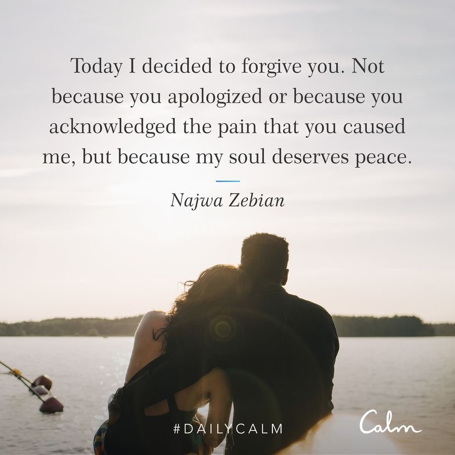
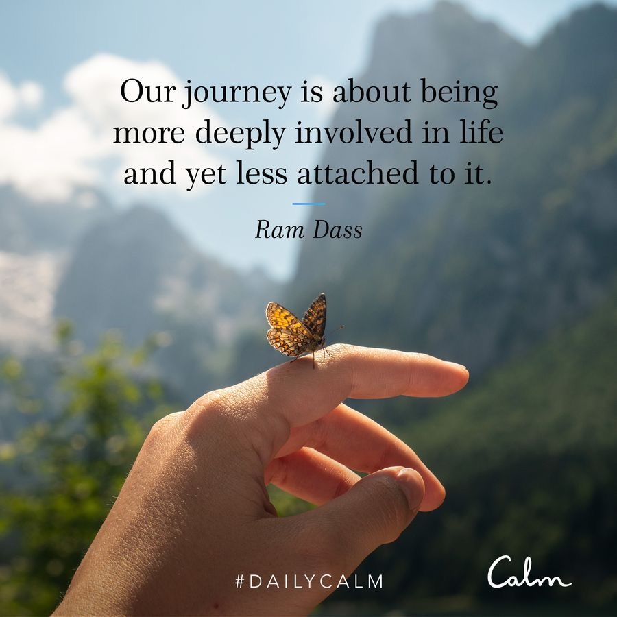

tags:: #2025 #2025/06 #Thursday
- 03:59 [[Daily Calm]] #Psychology #Mindfulness #Meditation : “Today I’d like to talk about forgiveness. We both felt the sting of hurtful words or harmful actions - perhaps a friend criticises our parenting skills or a colleague takes credit for our hard work - and ==whether or not they mean to hurt us, the resulting pain is real==. If we’re lucky, a sincere apology follows and that’s enough to help us move forward. But when sorry never comes, we’re left reliving the situation again and again in our mind with mounting resentment. And the thing is - ==if we don’t practice forgiveness, we are the ones left with the burden of anger and bitterness. Forgiveness isn’t meant to erase what happened, instead it’s a decision to let go of the resentment we’re holding onto. It allows the clutch of irritation and bitterness to loosen its grip. Choosing to forgive doesn’t deny the other person‘s role in hurting us and it doesn’t minimise or excuse the wrongdoing, but what it does do is create the opportunity for us to find peace.== The poet Najwa Zebian summed it up nicely when she wrote, ==“Today I decided to forgive you. Not because you apologised or because you acknowledged the pain that you caused me, but because my soul deserves peace.”== So when you find yourself on the receiving end of hurt, even though it’s not easy, make forgiveness an intention. ==Little by little, let go of your hurt and animosity. For as you forgive, you’ll set yourself free.==” — Tamara Levitt
	- **03:59** [[quick capture]]:  
- 23:37 [[Daily Calm]] #Meditation #Mindfulness #Psychology : “==We often notice that we experience a desire to feel a particular way in our practice==. Perhaps we want our body to feel relaxed or our mind to feel quiet. Meditation isn’t about making these things happen. ==It’s about accepting whatever is happening in the moment and letting go of our attachments. That means not making our pain wrong and pushing it away and not grasping towards a peaceful feeling. The less attached we are to feelings and objects and ideas, the less suffering we experience.== To qualify, non-attachment doesn’t mean being cold, distant or uncaring. What it means is we begin to relate to ourselves into the world in a more accepting way because we understand life’s ephemeral nature. ==Each of our relationships will change so we allow space for them to. Our bodies will change so we gently accept that. Our experiences will change so we don’t get as riled up when we face difficult emotions. We create goals but we aren’t attached to the outcome. We don’t chase happiness. We enjoy it when it’s present and when it’s not, that’s okay because we trust in the nature of impermanence knowing happier days are ahead.== As Ram Dass said, ‘Our journey is about being more deeply involved in life and yet less attached to it.’” — Tamara Levitt
	- **23:41** [[quick capture]]:  
	- #thoughts #questions 
	  I wonder what this means to emotional attachment? I often get attached when someone is intellectual enough to talk to me about different topics. I guess just accept that there’s currently someone I can talk to and accept that this might fade or go away instead of holding on to it.